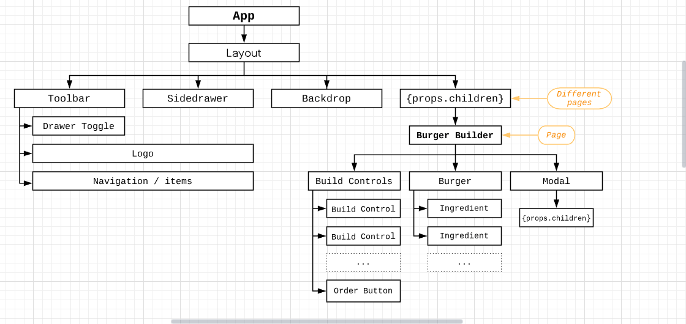
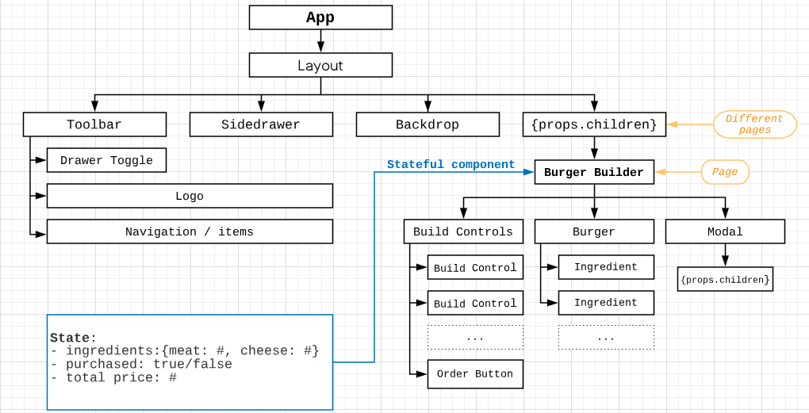
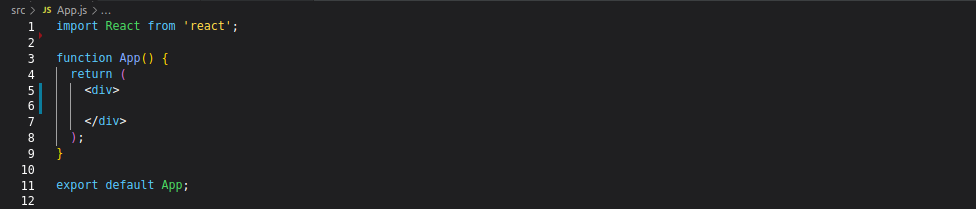

# Burger Builder (React Project)

## What

This project is part of a React course that can be found on Udemy. This README file contains step by step notes on how the project progressed.

## How

### 1: Planning the component tree

  
### 2: Planning the state

  
### 3: Setting up the project

#### 3a: Creating the project with `create-react-app`
`npx create-react-app burger-builder-react` (newest way of creating a react app with 'create-react-app')

#### 3b: Cleaning up the project code a little
* 'App.css' deleted since that file is not needed
* 'App.js' stripped of unnecessary code
    
* 'Open Sans' font embedded into 'index.html' file, right above title (which is also changed)   
* 'index.css' font-family changed to 'Open Sans'

  
### 4: Creating the Lay-out component

* New folders inside 'src' folder: components, containers
* components are stateless components (a.k.a dumb or presentational components)
* containers are stateful components (a.k.a. smart or functional components), 
* containers can be either class-based components using state or functional components using the 'useState' hook

----------
* New folder inside 'components' folder: Layout
* New file inside the folder: Layout.js

----------
*  Another new folder inside the 'src' folder: assets 
* will later be used for assets such as a logo

----------
* Lay-out component initial code:
* import React
* create a functional component, called layout
* pass props as a parameter inside the arrow function
* inside the function body, there are 2 main elements:
1. a div wrapping the future Toolbar, SideDrawer and Backdrop code
2. a main element that returns the code it will be wrapped around (by using props.children)
* since there can't be adjacent JSX elements without a wrapper component, one must be created

----------
* New folder inside the 'src' folder: hoc
* New file created inside 'hoc' folder: Aux.js
* holds a functional component that only returns 'prop.children' and a default export only

----------
* Finishing touches on 'Layout.js':
* import the new Aux wrapper component
* wrap the div and main element inside the Aux component
* export default layout

----------
* Import new Layout component into 'App.js'
* add Layout component inside of the root div tags

  
### 5: Creating the BurgerBuilder container: Pt. 1

* New folder inside 'containers' folder: BurgerBuilder
* New file inside 'BurgerBuilder' container: BurgerBuilder.js

----------
* BurgerBuilder.js initial code:
* BurgerBuilder will be a class-based component, so state can be used without 'useState'
* React must be imported, with the named import 'Component'
* inside the class, the lifecycle 'render()' method must be used
* inside that render, JSX is returned
* there are 2 main JSX elements:
        1. a div wrapping the burger code
        2. a div wrapping the build controls code
* 'Aux' hoc is imported & then used to wrap both divs

----------
* Implementation of BurgerBuilder component inside 'App.js':
* component, as always must be imported
* the previously written test code is replaced by the new component (self-closing tag)

----------
* Adding initial styling to placeholder elements:
* Inside the 'Layout.js' file, styling should be added to the main element:
* A new file is created inside the 'Layout' folder: Layout.module.css 
* a new class is created & a margin-top is added as a styling rule
* the css file is imported into the 'Layout.js' file using 'import classes'
* the className created in the css file is then added to the main element, using '{classes.Class}' syntax