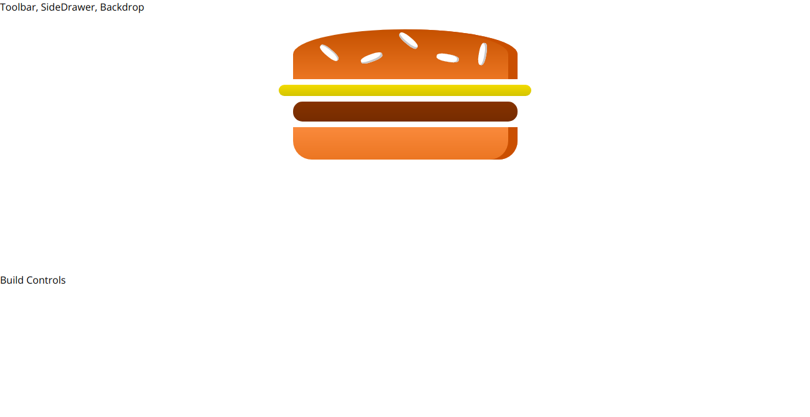
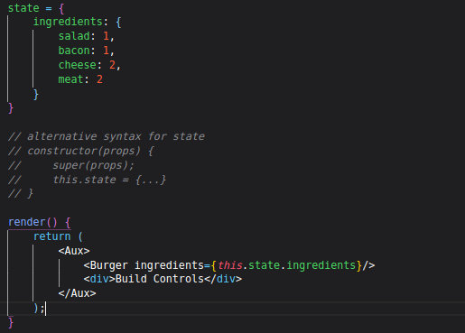
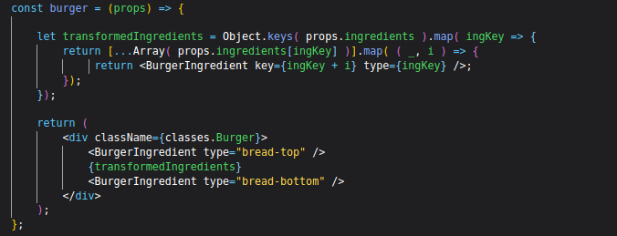
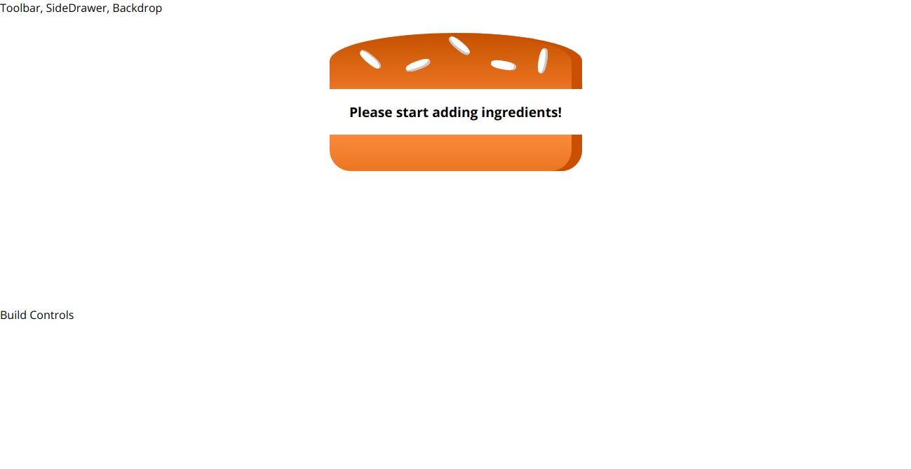
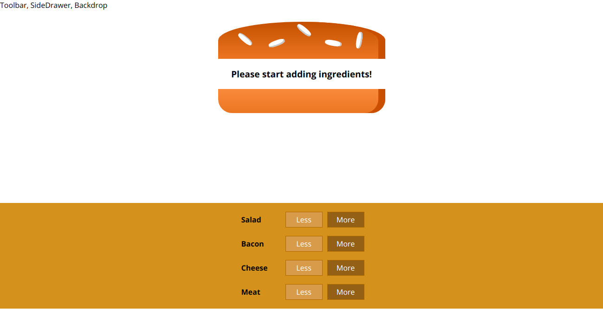
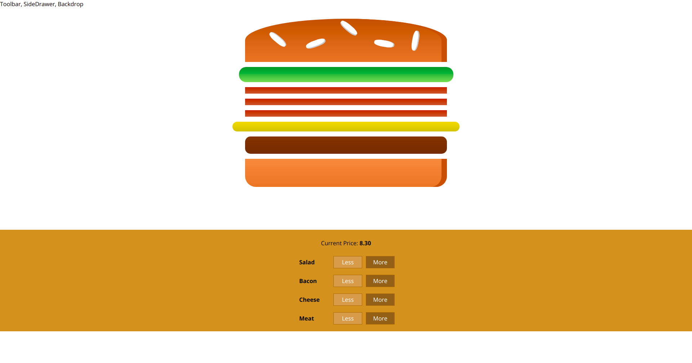

# Burger Builder (React Project)

## What

This project is part of a React course that can be found on Udemy. This README file contains notes that were taken as I progressed through the project

## How

### Planning the component tree

  
### Planning the state

  
### Setting up the project

#### 1: Creating the project with `create-react-app`
`npx create-react-app burger-builder-react` (newest way of creating a react app with 'create-react-app')

#### 2: Cleaning up the project code a little
* 'App.css' deleted since that file is not needed
* 'App.js' stripped of unnecessary code
    
* 'Open Sans' font embedded into 'index.html' file, right above title (which is also changed)   
* 'index.css' font-family changed to 'Open Sans'

  
### Lay-out component

New folders inside 'src' folder: components, containers, assets
* _components are stateless components (a.k.a dumb or presentational components)_
* _containers are stateful components (a.k.a. smart or functional components)_
* _containers can be either class-based components using state or functional components using the 'useState' hook_
* _'assets' will later be used for files such as a logo_

----------
New folder inside 'components' folder: Layout
* New file inside the folder: Layout.js

----------
Lay-out component initial code:
* import React
* create a functional component, called layout
* pass props as a parameter inside the arrow function
* inside the function body, there are 2 main elements:
1. a div wrapping the future Toolbar, SideDrawer and Backdrop code
2. a main element that returns the code it will be wrapped around (by using props.children)
* since there can't be adjacent JSX elements without a wrapper component, one must be created

----------
New folder inside the 'src' folder: hoc
* New file created inside 'hoc' folder: Aux.js
* holds a functional component that only returns 'prop.children' and a default export only

----------
Finishing touches on 'Layout.js':
* import the new Aux wrapper component
* wrap the div and main element inside the Aux component
* export default layout

----------
Import new Layout component into 'App.js'
* add Layout component inside of the root div tags

  
### Creating the BurgerBuilder container: Pt. 1

New folder inside 'containers' folder: BurgerBuilder
* New file inside 'BurgerBuilder' container: BurgerBuilder.js

----------
BurgerBuilder.js initial code:
* BurgerBuilder will be a class-based component, so state can be used without 'useState'
* React must be imported, with the named import 'Component'
* inside the class, the lifecycle 'render()' method must be used
* inside that render, JSX is returned
* there are 2 main JSX elements:
        1. a div wrapping the burger code
        2. a div wrapping the build controls code
* 'Aux' hoc is imported & then used to wrap both divs

----------
Implementation of BurgerBuilder component inside 'App.js':
* component, as always must be imported
* the previously written test code is replaced by the new component (self-closing tag)

----------
Adding initial styling to placeholder elements:
* inside the 'Layout.js' file, styling should be added to the main element:
* a new file is created inside the 'Layout' folder: Layout.module.css 
* a new class is created & a margin-top is added as a styling rule
* the css file is imported into the 'Layout.js' file using 'import classes'
* the className created in the css file is then added to the main element, using '{classes.Class}' syntax

### Dynamic Ingredient Component

Setting up the needed files:
* New folder inside the 'components' folder: Burger
* New file inside the 'Burger' folder: Burger.js
* New subfolder inside the 'Burger' folder: Burgeringredient
* New files in the newly created subfolder: Burgeringredient.js, Burgeringredient.module.css

----------
Adding CSS style rules that create the burger ingredients:
* CSS code for purely CSS ingredients (no images) copied from course resources and pasted inside the new css file

----------
Creating the Burgeringredient component: 
* Basic structure implementation: import React, functional component with props, export component
* Inside the function body, a variable ingredient is declared as null initially
* A switch statement is then used to check the type of prop (ingredient) & the 'ingredient' variable is set to JSX (a div with a className matching the case, using 'classes.className' syntax)
* The css file is imported (`import classes from './Burgeringredient.module.css'`)
* After the switch statement, the ingredient variable is returned

### Adding propType validation

3r party library 'prop-types' installed via npm in terminal: `npm install --save prop-types`
* Library then imported into 'Burgeringredient.js' file
* Right before the export, a new proptypes is declared on the component
* The value of that is an object, given a 'type' property and set to 'string', plus 'isRequired' (will give an error if it it not a string or the type is missing)

### Building the Burger Pt. 1

Initial 'Burger.js' code:
* Since JSX will be returned, react must be imported
* A functional component is created, using props as a parameter inside the arrow function
* Since the function body will contain both JSX logic and JSX code, it is wrapped with {}
* Inside the return, a div is created that will wrap the ingredients
* Since the component will be used in other components, it must be exported

----------
Adding CSS styling to the Burger component:
* New file inside the 'Burger' folder: Burger.module.css
* Styling rules are added to 'Burger' class (mobile first, media queries for larger screens)

----------
Implementing styling in 'Burger.js':
* The CSS file must be imported using 'import classes from' syntax 
* Inside the JSX, specifically the div element, a className is added (accessed through '{classes.Class}' syntax)
* Inside the div, different BurgerIngredient components are added (hard-coded for now)

----------
Implementing the Burger component into the BurgerBuilder:
* Burger component must be imported 
* Inside the JSX code, the first placeholder div is replaced by the Burger Component (self-closing tag)

### Dynamic Burger component

State in the BurgerBuilder component:
* State is added to the component
* Inside the state object, a new 'ingredient' object is added
* Inside the 'ingredient' object are the possible ingredients with an initial value
* Inside the JSX code returned in the Burger component, an attribute 'ingredients' is added, with a value referring to the ingredients inside the state

----------
Making the Burger component dynamic:
* To output the ingredients dynamically, they need to be an array
* Currently, they are object properties within the state though
* Inside the burger component, a new variable is declared, which transforms the object into an array holding the object's keys
* The 'map()' method is chained to newly created array to loop over all the ingredients inside of the array
* For each ingredient in the array, a new array is returned, which accesses the key's values and returns an array of the same length
* That array is then again looped over using 'map()'
* Finally, the BurgerIngredient is returned, with a dynamic key and type
* Inside the JSX that is returned, the `BurgerIngredients` between the bread are replaced by `{transformedIngredients}`

----------
Calculating Ingredient sum dynamically:
* Reset the values for the ingredients properties inside the 'BurgerBuilder' state to 0
* Use `reduce()` to create a flat array from the array of arrays
* Add if statement that displays a message if the array is empty (if length = 0)

### BuildControl component

New component/folder inside the 'Burger' component folder: BuildControls
* New file added to that newly created folder: Buildcontrols.js
* Create basic structure: import react, functional component with props, export
* Add `div` element inside functional body of component

----------
Adding styling
* New file added to the 'BuildControls' folder: BuildControls.module.css
* Create CSS rules for 'BuildControls' class selector

----------
New folder inside the 'BuildControls' folder: BuildControl
* New files inside the newly created folder: BuildControl.js, BuildControl.module.css
* Basic structure from 'BuildControls.js' is copy/pasted
* Inside the returned `div` inside the JSX code, 3 elements are added:
1. a div containing the label
2. a button for 'Less'
3. a buttom for 'More'
* CSS code copy/pasted from coure resources

----------
Finishing touches on `BuildControl` component:
* CSS file imported with `import classes from` syntax 
* Elements inside the returned JSX are all given matching class names

### BuildControls component

Adding styling to the 'BuildControls' component:
* The CSS module file is imported into 'BuildControls.js'
* Inside the returned JSX, the div is given a className, using the `{classes.BuildControls}` syntax

----------
Implementing the 'BuildControl' component into 'BuildControls':
* The component is imported
* A new array of controls is created outside the component function
* The array is an array of objects, each containing a label and a type
* Inside the returned JSX, between the div, the component is dynamically inserted
* The array is then looped over, using 'map()'
* Each iteration of the loop return a `BuildControl` component with a key and label

----------
Implementing 'BuildControls' component into 'BurgerBuilder':
* The module is imported into the 'BurgerBuilder' component
* The placeholder div is replaced by the newly imported component

### Connecting state to 'BuildControls' component:

New method: addIngredientsHandler, which updates the individual and total ingredient count, the price and then mutates the state 
* New global constant object (uppercase according to best practice) holding the prices of each individual ingredient
* New state property holding the total price, which starts at $4
* Add attribute with event handler to BuildControls component inside returned JSX 
* Add attribute to BuildControl component inside the returned JSX of the 'BuildControls.js' file as arrow function so type can be passed as a parameter
* Add onClick method to the'More' button inside the BuildControl returned JSX

New method: removeIngredientHandler, which follows the same logic as 'addIngredientHandler', but deducts instead of adds
* Event handler again passed to BuildControls component as a new attribute
* New attribute added to 'BuildControls.js' BuildControl component, again using arrow function
* New onClick function added to BuildControl.js returned JSX, this time inside 'Less' button
* Insert if statement inside 'removeIngredientHandler' to prevent state from having negative values
* Add a new array inside 'render()' and loop over it to mutate so it will return true if the value is 0 or less
* Add attribute to BuildControls and pass the new array to it
* Add attribute inside 'BulildControls.js' file using props
* Finally, pass te attribute to the 'Less' button inside the BuildControl file to disable button if count is 0

### Updating price

* BuildControls: new paragraph added above build control component that will display price (using props)
* BurgerBuilder: add attribute 'price' (used as prop in BuildControls) to BuildControls component and set to `this.state.totalPrice`
* BuildControls: wrap dynamic price in `strong` tags, plus add `toFixed(2)' to the price to avoid more than 2 decimals

